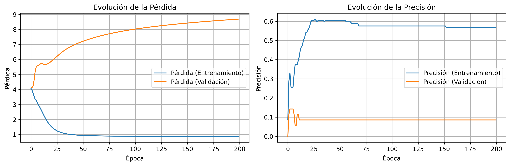

# 🤖 Proyectos de Redes Neuronales Recurrentes (RNN)

Repositorio con proyectos de implementación de RNN usando TensorFlow/Keras para diferentes tareas de procesamiento de lenguaje natural.

## 📚 Proyectos Incluidos

### 1. 🦖 Generador de Nombres de Dinosaurios
**Archivo:** `RNN_generacion_nombres.py`

Red neuronal recurrente que aprende a generar nombres de dinosaurios basándose en patrones de caracteres.

**Características:**
- Genera nombres carácter por carácter
- Entrenamiento con 10,000 iteraciones
- Dataset de nombres reales de dinosaurios

**Uso:**
```bash
python RNN_generacion_nombres.py
```

---

### 2. 💬 Predictor de Siguiente Palabra en Saludos
**Archivo:** `prediccion_saludos_RNN.py`

Sistema de predicción de la siguiente palabra en frases de saludo usando embeddings y RNN.

**Características:**
- ✅ **Tokenización y Padding** de secuencias
- ✅ **Arquitectura Embedding + RNN + Dense**
- ✅ **Predicción con probabilidades**
- ✅ **Generación de texto completo**
- ✅ **Métricas de evaluación**
- ✅ **Visualización de entrenamiento**

**Dataset:**
- 93 frases de saludo en español
- 60 palabras únicas de vocabulario
- 174 secuencias de entrenamiento

**Métricas:**
- Precisión en entrenamiento: 56.83%
- Loss final: 0.8738

**Ejemplos de predicción:**
```
Entrada: "hola"
Predicción: "amigo" (20.87% confianza)

Entrada: "buenos días"
Predicción: "a" (28.42% confianza)

Entrada: "cómo estás"
Predicción: "hoy" (33.65% confianza)
```

**Uso:**
```bash
# Entrenar el modelo
python prediccion_saludos_RNN.py

# Probar interactivamente
python inferencia_interactiva.py
```

**Documentación completa:** Ver [README_SALUDOS.md](README_SALUDOS.md)

---

## 🛠️ Instalación

### Requisitos
- Python 3.12+
- TensorFlow 2.20.0
- Keras 3.12.0
- NumPy 2.3.4
- Matplotlib 3.10.7

### Instalación de dependencias
```bash
# Crear entorno virtual
python -m venv .venv

# Activar entorno (Windows PowerShell)
.\.venv\Scripts\Activate.ps1

# Instalar dependencias
pip install tensorflow keras numpy matplotlib
```

---

## 📁 Estructura del Proyecto

```
ejemploRNN/
├── .venv/                          # Entorno virtual
├── .env                            # Variables de entorno
├── .gitignore                      # Archivos ignorados por git
│
├── README.md                       # Este archivo
├── README_SALUDOS.md              # Documentación detallada del predictor
│
├── nombres_dinosaurios.txt         # Dataset dinosaurios
├── RNN_generacion_nombres.py       # Generador de nombres
│
├── saludos_dataset.txt             # Dataset de saludos
├── prediccion_saludos_RNN.py       # Predictor de palabras
├── inferencia_interactiva.py       # Script de prueba interactivo
├── modelo_saludos_rnn.keras        # Modelo entrenado
├── tokenizer_saludos.pickle        # Tokenizer guardado
├── entrenamiento_metricas.png      # Gráficas de métricas
│
└── subir_a_github.ps1             # Script para subir a GitHub
```

---

## 🎯 Conceptos Implementados

### Generador de Nombres (RNN Carácter a Carácter)
- ✅ Secuencias de caracteres
- ✅ One-hot encoding
- ✅ SimpleRNN con estados ocultos
- ✅ Optimización con SGD
- ✅ Generación iterativa

### Predictor de Palabras (RNN con Embeddings)
- ✅ Tokenización de texto
- ✅ Padding de secuencias
- ✅ Word embeddings (dimensión 100)
- ✅ Arquitectura Embedding → RNN → Dense
- ✅ Predicción probabilística con softmax
- ✅ Métricas de evaluación (accuracy, loss)
- ✅ Visualización de entrenamiento

---

## 📊 Resultados

### Generador de Nombres de Dinosaurios
Genera nombres como:
- `aquhaaa`
- `snuyarysouoauk`
- `chamwurpc`
- `hupabls`

### Predictor de Saludos

**Evolución del entrenamiento:**



**Tabla de predicciones:**

| Entrada | Top Predicción | Confianza |
|---------|----------------|-----------|
| "hola" | "amigo" | 20.87% |
| "buenos" | "días" | 99.89% |
| "qué" | "tal" | 61.08% |
| "cómo estás" | "hoy" | 33.65% |
| "buenas noches" | "amigo" | 50.43% |

---

## 🚀 Guía Rápida

### Probar el Generador de Nombres
```bash
python RNN_generacion_nombres.py
```
Espera a que termine el entrenamiento (10,000 iteraciones) y verás 100 nombres generados.

### Probar el Predictor de Saludos

**1. Entrenar (si no lo has hecho):**
```bash
python prediccion_saludos_RNN.py
```

**2. Modo interactivo:**
```bash
python inferencia_interactiva.py
```

Luego escribe frases como:
- `hola`
- `buenos días`
- `cómo estás`
- `qué tal`

El sistema te mostrará:
- Las 5 palabras más probables con sus porcentajes
- Una frase generada completando tu entrada

---

## 📝 Casos de Uso

### Generador de Nombres
- Generación de nombres creativos
- Estudio de patrones en secuencias de caracteres
- Demostración de RNN para texto

### Predictor de Saludos
- **Autocompletado de texto** en chats
- **Sugerencias de respuesta** en mensajería
- **Sistemas de respuesta automática**
- **Análisis de patrones de lenguaje**
- **Chatbots conversacionales**

---

## 🧠 Tecnologías Utilizadas

- **Python 3.12**
- **TensorFlow 2.20** - Framework de deep learning
- **Keras 3.12** - API de alto nivel para redes neuronales
- **NumPy** - Operaciones numéricas
- **Matplotlib** - Visualización de datos

---

## 📖 Aprendizajes Clave

1. **Procesamiento de secuencias** con RNN
2. **Tokenización y encoding** de texto
3. **Embeddings de palabras** para representación densa
4. **Arquitecturas secuenciales** en Keras
5. **Métricas de evaluación** para NLP
6. **Overfitting** y técnicas de regularización
7. **Inferencia y generación** de texto

---

## 🔍 Mejoras Futuras

- [ ] Implementar LSTM para mejor memoria a largo plazo
- [ ] Agregar capas de Dropout para reducir overfitting
- [ ] Aumentar el dataset de saludos
- [ ] Implementar Attention Mechanism
- [ ] Crear API REST para inferencia
- [ ] Agregar soporte para múltiples idiomas
- [ ] Implementar beam search para generación

---

## 👨‍💻 Autor

**Miller**  
Universidad Católica Sedes Sapientiae (UCSS)  
Ciclo 09 - Inteligencia Artificial  
2025

---

## 📄 Licencia

Este proyecto es de código abierto y está disponible para fines educativos.

---

## 🤝 Contribuciones

Las contribuciones son bienvenidas. Si deseas mejorar el proyecto:

1. Haz un fork del repositorio
2. Crea una rama para tu feature (`git checkout -b feature/MejoraNombre`)
3. Commit tus cambios (`git commit -m 'Añade nueva funcionalidad'`)
4. Push a la rama (`git push origin feature/MejoraNombre`)
5. Abre un Pull Request

---

## 📧 Contacto

Si tienes preguntas o sugerencias, no dudes en abrir un issue en el repositorio.

---

## ⭐ Agradecimientos

- Dataset de nombres de dinosaurios
- Comunidad de TensorFlow/Keras
- Documentación oficial de Keras

---

**¡Dale una ⭐ si este proyecto te fue útil!**
